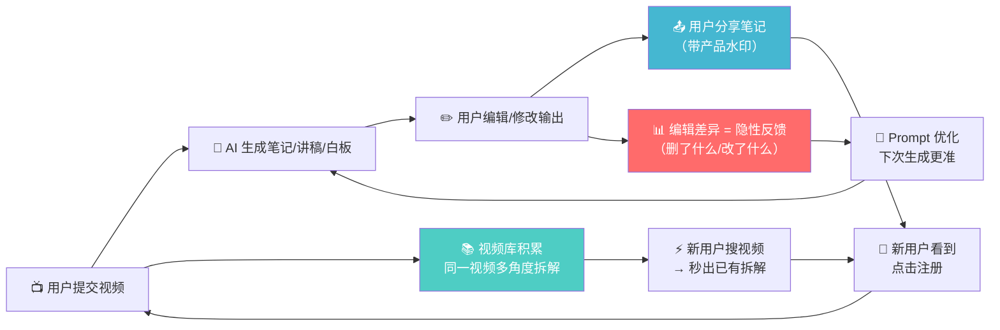

# 视频拆解 Pipeline 产品 · 数据飞轮深度分析

> 基于 Lenny Skills `designing-growth-loops`（54位产品领袖，84条洞察）
> 分析对象：视频→笔记/讲稿/白板 的 AI Pipeline 作为产品

---

## 先纠正一个前提：目标用户不只是 KOL

你说得对。把用户限定为「KOL/内容创作者」是人为缩小市场。

| 用户群 | 场景 | 频率 | 付费意愿 |
|:---|:---|:---|:---|
| 📹 **内容创作者/KOL** | 拆解英文视频 → 做中文内容 | 每周 1-2 次 | 高（省时间=赚钱） |
| 📚 **学习者** | 看 YouTube 学技能 → 想要结构化笔记 | **每天** | 中（省理解成本） |
| 🏫 **培训师/老师** | 把英文课程转化为中文教学材料 | 每周 | 高（教学效率） |
| 🏢 **企业培训** | 外部视频课 → 内部培训素材 | 每月 | 很高（团队效率） |

> [!IMPORTANT]
> **学习者的市场远大于 KOL。** 但两个方向的飞轮结构不同。下面用 Lenny 框架分别检测。

---

## 一、Hamilton Helmer 飞轮物质性测试

> *"We laugh whenever we hear somebody say they have a flywheel. The ones that really are material, are rare. The key thing is materiality — not whether the flywheel exists, but whether the effect is strong enough to really tilt returns."* — Hamilton Helmer

### 测试问题：这个飞轮的效应足够强到改变经济回报吗？

| 检测维度 | 方向A：学习者工具 | 方向B：KOL 内容生产 |
|:---|:---|:---|
| **数据越多→产品越好？** | ✅ 强。每个视频被多个用户拆解 → 积累「视频→最优拆解」映射 → 新用户秒出结果 | ⚠️ 中。KOL 的输出高度个性化，复用性低 |
| **用户越多→新用户越受益？** | ✅ 强。100人拆过同一个视频 → 第101人不用等 AI 跑 → 直接看最佳版本 | ❌ 弱。KOL A 的讲稿对 KOL B 没用 |
| **竞品能复制这个效应吗？** | ⚠️ 能（ChatGPT 也能总结视频） | ⚠️ 能（但没画像系统） |
| **Hamilton 判定** | **有物质性，但需要防御壁垒** | **物质性弱** |

---

## 二、Seth Godin 网络效应内生测试

> *"If you don't build the network effect into what you are making, you are almost certainly going to fail. The question is, will this work better for my users if they tell other people about it?"* — Seth Godin

### 测试问题：用户邀请别人来用，自己的体验会变好吗？

| 方向 | 用户邀请后自己的体验变好吗？ | 判定 |
|:---|:---|:---|
| **学习者工具** | ✅ 是。更多人拆同一视频 → 多角度笔记出现 → 你看到别人关注了你没注意的点 | **内生网络效应** |
| **KOL 内容生产** | ❌ 否。更多 KOL 用 = 更多竞品内容 → 对你不利 | **反网络效应** |

> [!CAUTION]
> **KOL 方向有反网络效应风险。** 如果你和竞争对手用同一个工具生成内容，内容同质化 → 用户越多对你越不利。学习者方向则相反。

---

## 三、Shishir Mehrotra 双环测试（Black Loop vs Blue Loop）

> *"The Black Loop is someone comes in, makes a doc, shares with a group of people, some subset turn around and make another doc. The Blue Loop is someone makes a doc, publishes it to the world."* — Shishir Mehrotra

### 这个产品有哪种 Loop？

```
🔵 Blue Loop（发布型 — 学习者方向）
┌──────────────────────────────────────────┐
│                                          │
│  用户拆解视频 → 生成笔记                  │
│       ↓                                  │
│  分享笔记到社交媒体/学习社区               │
│       ↓                                  │
│  新用户看到：「这笔记做得好整齐」           │
│       ↓                                  │
│  搜到你的产品 → 注册 → 拆自己的视频        │
│       ↓                                  │
│  又分享 → 循环                            │
│                                          │
└──────────────────────────────────────────┘

⬛ Black Loop（协作型 — 学习小组方向）
┌──────────────────────────────────────────┐
│                                          │
│  用户 A 拆了一个视频 → 分享给学习小组      │
│       ↓                                  │
│  小组成员 B、C 各自补充不同角度的笔记       │
│       ↓                                  │
│  一个视频有了 3 个视角的拆解               │
│       ↓                                  │
│  小组里新来的 D → 注册产品 → 也开始拆      │
│       ↓                                  │
│  协作 → 循环                              │
│                                          │
└──────────────────────────────────────────┘
```

**判定：学习者方向同时具备 Blue Loop + Black Loop。KOL 方向只有 Blue Loop（且动力弱）。**

---

## 四、Julian Shapiro UGC 增长引擎测试

> *"If users use the product to make content in any form, and they share it elsewhere, then that's users making content they're sharing off platform — that is useful for their own followers."* — Julian Shapiro

### 测试：用户会不会自然分享产品的输出？

| 产出物 | 学习者会分享吗？ | KOL 会分享吗？ |
|:---|:---|:---|
| **笔记 (breakdown)** | ✅ 大概率分享到学习群/朋友圈 「今天拆了一个好视频」 | ❌ 不会。这是 KOL 的「原材料」，不想让人知道 |
| **白板 (excalidraw)** | ✅ 视觉冲击力强 → 发小红书/朋友圈 | ⚠️ 可能当素材用，但会去掉你的品牌 |
| **讲稿 (script)** | ⚠️ 不太会直接分享 | ❌ 不会 |

> [!IMPORTANT]
> **关键洞察：学习者会把你的产出当成社交货币分享，KOL 会把你的产出当成商业秘密隐藏。**
>
> 这直接决定了哪个方向有 UGC 驱动的增长飞轮。

---

## 五、Uri Levine 使用频率测试

> *"Word-of-mouth you can only have if you have high frequency of use."* — Uri Levine

| 方向 | 使用频率 | 口碑传播潜力 |
|:---|:---|:---|
| **学习者** | **每天**（每天看视频学东西） | ✅ 高频 → 天天有机会跟朋友说 |
| **KOL** | 每周 1-2 次 | ⚠️ 中频 → 口碑传播慢 |

---

## 六、Elena Verna AI 品类创新测试

> *"In fast-moving AI categories, growth requires constant innovation of new loops rather than incremental optimization."* — Elena Verna

### 这个产品能创造什么「别人没有的增长 Loop」？

**学习者方向可以做到的独特 Loop：**

```
🔄 「视频笔记 × 社区」Loop（竞品没有的）

用户拆视频 → 笔记自动带产品水印/品牌
       ↓
分享到学习社区 → 其他人看到
       ↓
「这个笔记哪来的？」→ 点链接 → 注册
       ↓
新用户也拆 → 也分享 → 循环

关键: 笔记本身就是广告，但因为有价值所以不被当广告
```

这就是 Julian Shapiro 说的 **"Billboarding"**：

> *"Use 'billboarding' by placing branding on the product's output — 'Sent via Hotmail' or 'Powered by Calendly'"* — Julian Shapiro

你的白板笔记（excalidraw 输出）天然适合 Billboarding — 底部加一行「Made with [产品名]」。

---

## 七、完整飞轮模型（学习者方向）



### 飞轮三个加速轮

| 轮 | 数据资产 | 加速效应 | 壁垒 |
|:---|:---|:---|:---|
| 🔴 **质量轮** | 用户编辑差异 | 越多人用 → 输出越准 → 越少需要编辑 → NPS ↑ | **ChatGPT 没这个闭环** |
| 🟢 **覆盖轮** | 视频拆解库 | 越多视频被拆 → 新用户搜到已有结果 → 即时价值 | **先发优势 + 规模效应** |
| 🔵 **传播轮** | 用户分享的笔记 | 每一张分享的笔记 = 免费广告 → CAC→0 | **UGC 内容别人无法复制** |

---

## 八、方向对比总表

| 维度 | 📚 学习者工具 | 📹 KOL 内容生产 |
|:---|:---|:---|
| Seth Godin 网络效应 | ✅ 内生 | ❌ 反网络效应 |
| Hamilton Helmer 物质性 | ✅ 有 | ⚠️ 弱 |
| Shishir 双环 | ✅ Blue + Black | ⚠️ 仅 Blue |
| Julian UGC 分享 | ✅ 自然分享 | ❌ 隐藏不分享 |
| Uri 使用频率 | ✅ 每天 | ⚠️ 每周 |
| Elena AI 创新 | ✅ Billboarding Loop | ⚠️ 通用工具 |
| 市场规模 | 🔥 所有看英文视频学习的人 | 📌 做二创内容的 KOL |
| **综合判定** | **🏆 强飞轮 + 大市场** | **弱飞轮 + 小市场** |

---

## 九、战略建议

> [!TIP]
> **做学习者方向。** 不是因为 KOL 方向不好，而是因为学习者方向的飞轮在 6 个 Lenny 框架里全部通过，而 KOL 方向只通过了 1 个。

### 定位调整

```diff
- 视频拆解工具 → 帮 KOL 做内容
+ 视频学习助手 → 帮学习者把英文视频变成可用知识
```

### 产品口号候选

- "看英文视频，出中文笔记" 
- "一个视频，一页手绘笔记" → 强调 excalidraw 白板输出的视觉差异化

### 和 [product-opportunity-analysis.md](file:///Users/qrebecca/information%20radiators/01-projects/xiaohongshu-foreign-trade/product-opportunity-analysis.md) 的关系

| 原路径 | 新路径 |
|:---|:---|
| 内容获客 → 英语角 → 训练营 → AI 口语陪练 | 内容获客 → **视频学习助手（先发）** → 英语角 → 训练营 |
| AI 产品化在第 4-6 个月 | **视频学习助手可以更早做（你已经有 `run_breakdown.py`）** |

> **核心逻辑的变化**：不是用 AI 替代你教口语，而是用 AI 帮用户自学 → 你的角色从「老师」变成「工具提供者」→ 规模不受你个人时间限制。
